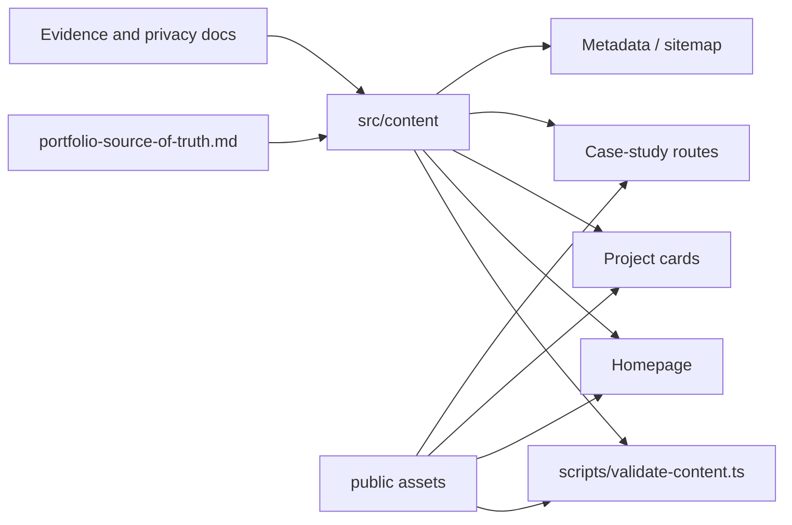

# Application architecture

## Purpose and boundaries

This is a small repository-managed portfolio, not a content platform. Typed
TypeScript modules hold editable content, React components render it, and the
Next.js App Router generates the homepage and project pages. There is no runtime
database, CMS, authentication layer, or content API.

The main boundary is:

```text
human-approved facts and evidence
        ↓
src/content/ typed modules
        ↓
content validation
        ↓
server-rendered routes and reusable components
        ↓
static production output
```

Presentation components should not become competing sources for contact details,
project metadata, navigation, or frequently edited homepage copy.

## Directory structure

```text
.
├── src/
│   ├── app/
│   │   ├── layout.tsx              global shell and metadata
│   │   ├── page.tsx                homepage composition
│   │   ├── work/[slug]/page.tsx    generated case-study route
│   │   ├── globals.css             tokens and all visual styling
│   │   ├── opengraph-image.tsx     generated social preview
│   │   ├── sitemap.ts              generated public route index
│   │   └── robots.ts               crawler policy
│   ├── components/                 reusable rendering units
│   ├── content/                    editable public content and schemas
│   ├── lib/                        framework-independent helpers
│   └── systems/                    cross-page browser behavior
├── scripts/                        repository maintenance commands
├── public/                         publication-safe static assets
├── docs/                           maintenance and evidence documentation
├── research/                       historical discovery evidence
└── portfolio-source-of-truth.md    canonical human-provided profile
```

## Route hierarchy

```text
RootLayout
├── SiteHeader
├── /                              homepage
│   ├── hero
│   ├── current work
│   ├── technical range
│   ├── selected projects
│   ├── experience
│   ├── approach
│   ├── foundation
│   └── SiteFooter
├── /work/[slug]                   one route per published project
│   ├── case-study hero
│   ├── evidence boundary
│   ├── optional gallery
│   ├── narrative sections
│   ├── technical notes
│   ├── next-project link
│   └── SiteFooter
├── /opengraph-image               generated social image
├── /icon.svg                      App Router favicon
├── /sitemap.xml                   generated from published projects
├── /robots.txt                    generated crawler policy
└── framework status routes        loading, error, not-found
```

`generateStaticParams()` in `src/app/work/[slug]/page.tsx` reads the filtered
`projects` export. A project with `display: "hidden"` or
`visibility: "confidential"` is absent from the homepage, static parameters,
sitemap, and public next-project sequence.

## Layout hierarchy

`src/app/layout.tsx` owns:

- document language;
- self-hosted `next/font` variables;
- global metadata and canonical homepage URL;
- the pre-paint theme bootstrap;
- skip navigation;
- the shared site header;
- global CSS.

Individual routes own their `<main>` content and footer. Project routes generate
their own title, description, canonical URL, and Open Graph values from the
project model.

## Content flow



The editable modules have distinct responsibilities:

- `profile.ts` — identity, education, contact, socials, portrait, résumé.
- `navigation.ts` — labels and canonical homepage anchor IDs.
- `home.ts` — homepage narrative and experience copy.
- `projects.ts` — project order, visibility, proof, limitations, technologies,
  media, and case-study sections.
- `site-settings.ts` — global title, descriptions, availability, and site URL.
- `types.ts` — shared content contracts.
- `validation.ts` — runtime integrity and publication-safety rules.

This separation avoids duplicate sources without splitting every sentence into a
separate file.

## Component categories

### Site shell

- `SiteHeader` renders navigation, theme control, and availability.
- `SiteFooter` renders the contact action, social links, optional résumé, and
  authorship note.
- `ThemeToggle` and `LogoMark` are the small interactive client components in
  the site shell.

### Content display

- `ProjectCard` renders summary-level project evidence.
- `RangeLine` maps a project onto the systems-to-people axis.
- `SectionHeading` enforces homepage section hierarchy.
- `ProfilePortrait` renders an approved profile image or the current placeholder.
- `ContentImage` renders validated cover/gallery media and optional captions.
- `StructuredData` safely serializes JSON-LD into the homepage.

Components receive content or import a single appropriate content source. They do
not define project facts.

## Theme flow

```text
system preference or saved localStorage value
        ↓
inline bootstrap in <head>
        ↓
data-theme="light|dark" on <html>
        ↓
semantic CSS custom properties in globals.css
        ↓
all components
```

`src/systems/theme.ts` defines the storage key and the pre-paint script.
`ThemeToggle` updates the root attribute, native `color-scheme`, persisted value,
and `aria-pressed`. CSS provides the light fallback if JavaScript or storage is
unavailable.

`src/systems/logo-mark.ts` similarly restores the logo’s short-lived expanded
state before paint. `LogoMark` mirrors that root attribute in React, persists it
through home navigation, and clears both representations after an outside tap.

See `docs/theme-maintenance.md` before changing this flow.

## Asset flow

1. A maintainer places an approved asset in the appropriate `public/` directory.
2. Its root-relative path, intrinsic dimensions, and alt text are added to
   `profile.ts` or `projects.ts`.
3. `npm run validate:content` verifies path shape, required alt text, dimensions,
   and file existence.
4. `next/image` renders profile and project images.
5. The production build optimizes referenced images.

The generated favicon and default Open Graph image use App Router files under
`src/app/`; they are not public-directory assets.

## Metadata flow

`site-settings.ts` supplies global title and descriptions. `layout.tsx` builds
global Metadata, project routes derive route-specific metadata, and
`opengraph-image.tsx` renders the shared social image. `sitemap.ts` includes only
published project routes. `robots.ts` points crawlers to that sitemap.

`NEXT_PUBLIC_SITE_URL` supplies the production origin. The local fallback exists
only to keep development deterministic.

## Validation and failure behavior

`npm run validate:content` executes the same typed modules used by the site. It
rejects:

- duplicate or malformed project slugs;
- invalid publication/visibility combinations;
- invalid technical ranges;
- empty required project fields or case-study sections;
- duplicate technologies or section titles;
- invalid social/repository URLs;
- malformed profile, résumé, and image paths;
- missing alt text or intrinsic dimensions;
- missing referenced files;
- navigation targets outside the declared homepage sections;
- invalid production origins.

`npm run check` adds linting, static type checking, and a production build.

## Deliberately hardcoded presentation copy

Unique status-page text, case-study interface labels such as “Context” and
“Technical notes,” the range accessibility sentence, and theme-control labels
remain in their presentation files. They are tightly coupled to one component
and are unlikely to be normal content updates. Moving them would add indirection
without removing a meaningful duplicate source.
