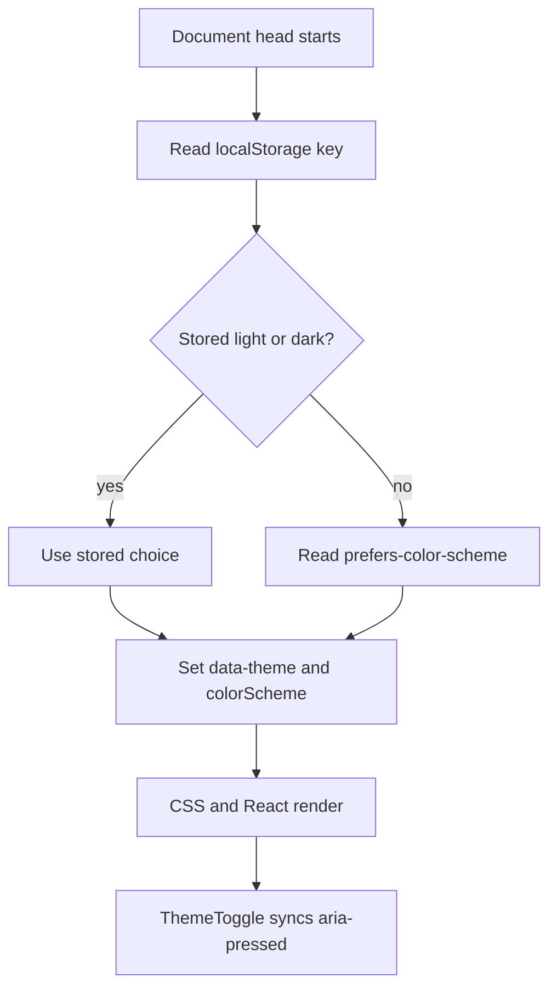

# Light and dark theme maintenance

The portfolio uses two semantic CSS palettes and one small client control. There
is no theme package and no duplicated dark-mode component tree.

## Files involved

| File | Responsibility |
|---|---|
| `src/app/globals.css` | Light tokens on `:root`, dark overrides on `:root[data-theme="dark"]`, component behavior |
| `src/systems/theme.ts` | Theme type, storage key, pre-paint bootstrap script |
| `src/components/ThemeToggle.tsx` | User interaction, persistence, `aria-pressed` |
| `src/app/layout.tsx` | Inline bootstrap placement, native color-scheme metadata, browser theme colors |
| `src/app/icon.svg` | Static identity colors outside document CSS |
| `src/app/opengraph-image.tsx` | Generated-image colors outside document CSS |

## Initialization flow



`themeBootstrapScript` is injected in `<head>` before body content. It sets:

```html
<html data-theme="light">
```

or:

```html
<html data-theme="dark">
```

before the interface paints. This prevents a light-first flash for saved/system
dark users.

If storage or `matchMedia` fails, CSS falls back to the light `:root` palette.

## System preference

On first visit, with no saved value, the script reads:

```js
window.matchMedia("(prefers-color-scheme: dark)").matches
```

The site chooses the system preference at page initialization. It does not
currently listen for a live operating-system theme change while the page remains
open. A manual portfolio choice takes priority on later loads.

Add live system synchronization only if requested; do not override an explicit
saved choice.

## Persistence

The storage key is:

```ts
export const themeStorageKey = "umar-portfolio-theme";
```

`ThemeToggle` alternates `light`/`dark`, writes the key to `localStorage`, updates
the root dataset and native `style.colorScheme`, and sets `aria-pressed`.

Changing the storage key forgets existing users’ choices. Treat that as a small
migration decision and record it in `docs/decisions.md`.

## CSS behavior

Light is the default:

```css
:root {
  color-scheme: light;
  --color-bg-primary: #f8f5f6;
  /* semantic light tokens */
}
```

Dark overrides the same roles:

```css
:root[data-theme="dark"] {
  color-scheme: dark;
  --color-bg-primary: #111113;
  /* semantic dark tokens */
}
```

Components should not need theme selectors. They consume the same semantic token
in both modes. Use a theme-specific selector only for behavior that cannot be
expressed through a role token, such as which visible label the toggle shows.

## Add a semantic token

1. Name the role, not the color:

   ```css
   --color-evidence-surface: #...;
   ```

2. Add a light value to `:root`.
3. Add a dark value to `:root[data-theme="dark"]`.
4. Use the variable in the component CSS.
5. Verify every text/border/focus pair on that surface.
6. Update `docs/design-system.md`; add the exact palette value to
   `docs/brand-identity.md` if it is part of the brand system.
7. Run both theme tests and `npm run check`.

Do not name a token `--red-2` or copy raw hex values into a component.

## Change an existing token

Keep the semantic role stable. For example, a brand fill must still support white
text, focus visibility, and hover distinction after changing its value.

Check all consumers:

```bash
rg -n -- "--color-brand-fill" src/app/globals.css
```

If page-background colors change, synchronize the `themeColor` values in
`src/app/layout.tsx`. If brand colors change, review `src/app/icon.svg` and
`src/app/opengraph-image.tsx`, which cannot consume document CSS variables.

## Component theme behavior

- Header background uses a mode-specific translucent token and backdrop blur.
- Theme disc uses a half-filled semantic maroon/transparent construction.
- Range/about/case surfaces switch from pale maroon to blackened maroon.
- Lead project remains a strong maroon fill with mode-specific fill and readable
  on-brand text.
- Footer stays deep maroon in both modes with dedicated footer text tokens.
- Profile/project images do not receive automatic color filters.
- Native form/browser surfaces inherit `color-scheme`. The footer contact form uses
footer tokens for light text on deep maroon; verify inputs, placeholders, focus
rings, and status messages in both themes.

## Charts and future diagrams

The current site has no chart library. `RangeLine` is a labelled diagram, and
labels/geometry duplicate its color meaning.

If a chart is added:

- define semantic series tokens in both modes;
- do not distinguish adjacent series only by maroon shades;
- add labels/patterns/geometry;
- test tooltips, axes, grid lines, and focus in both themes;
- do not add a global chart theme dependency for one visual.

## Contrast requirements

The current core token pairs and measured ratios are in
`docs/brand-identity.md`. Maintain at least the project’s WCAG AA target:

- 4.5:1 for ordinary text;
- 3:1 for large text and meaningful graphical boundaries;
- clearly visible keyboard focus against every adjacent surface.

Also verify hover/focus states, text on brand fills, muted metadata, footer text,
and selected maroon climates. Passing one page-background ratio does not prove
the same token works on every surface.

## Manual theme test

### System preference

1. Clear the saved choice:

   ```js
   localStorage.removeItem("umar-portfolio-theme");
   ```

2. Set the browser/OS emulation to light; reload.
3. Set it to dark; reload.
4. Confirm the correct mode appears before content paint.

### Manual choice

1. Toggle to the opposite mode.
2. Confirm `aria-pressed` changes.
3. Reload and confirm persistence.
4. Change system preference and reload; the saved manual choice should win.

### Visual scope

Check:

- homepage hero, range, lead/supporting cards, about, footer;
- at least one private/sanitized and one public case study;
- header while scrolling;
- focus rings and skip link;
- profile placeholder/image;
- optional project media and captions;
- mobile and desktop.

### Reduced motion

Emulate `prefers-reduced-motion: reduce` and confirm:

- smooth scroll becomes automatic;
- range animation and transitions collapse;
- reveal sections and range fills show their final state immediately;
- button hover does not translate;
- project-card lift, shadow, cover, and arrow hover transforms are suppressed;
- no content disappears.

Finish with:

```bash
npm run check
```

## Common theme failures

- **Flash before dark mode:** bootstrap moved below body content, was made async,
  or throws before setting the dataset.
- **Toggle looks right but native controls do not:** `style.colorScheme` was not
  updated.
- **Theme resets after reload:** storage key changed or storage writes fail.
- **One component stays light:** it uses a raw color or missing dark token.
- **Hydration warning:** server/client markup depends on browser-only theme state;
  keep visual theme in CSS and synchronize accessibility state after mount.
- **Metadata browser bar is wrong:** `themeColor` values in `layout.tsx` are out
  of sync with page grounds.
